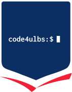

General information about the Code4ULBS initiative - Project Requirements and Guidelines

## Welcome to Code4ULBS! 👋

This document serves as the central guide for all developers working on ULBS projects. Whether you're a new joiner or an experienced contributor, this README outlines the mandatory requirements and best practices that apply to **all** Code4ULBS projects, regardless of technology stack.

---

## 📋 Table of Contents

1. [Mandatory Project Requirements](#-mandatory-project-requirements)
2. [Code Quality & Analysis](#-code-quality--analysis)
3. [Version Control & Collaboration](#-version-control--collaboration)
4. [Testing Requirements](#-testing-requirements)
5. [Deployment & Environments](#-deployment--environments)
6. [Security & Secret Management](#-security--secret-management)
7. [Development Environment Setup](#-development-environment-setup)
8. [Design Guidelines](#-design-guidelines)
9. [Organization Structure](#-organization-structure)
10. [Issue-Driven Development](#-issue-driven-development)
11. [Getting Started Checklist](#-getting-started-checklist)
12. [Discord - Official Communication](#-discord---official-communication)

---

## 🎯 Mandatory Project Requirements

Every Code4ULBS project **MUST** implement and maintain the following:

### ✅ Core Requirements

- **Linting and Code Analysis** - Automated code quality checks
- **Protected Main Branch** - PRs and code reviews are mandatory
- **AI Agent Instructions** - `copilot-instructions.md` or similar for AI coding assistants
- **Containerization Support** - Both Podman and Docker compatibility
- **CI/CD Pipelines** - GitHub Actions workflows for automatic deployment
- **End-to-End Testing** - Automated E2E tests (e.g., Playwright) running at least once daily
- **Unit Testing** - High coverage (minimum 80%) with pre-commit hooks
- **Environment Separation** - Production, Staging/Development environments
- **IDE Setup Documentation** - Instructions for VS Code, IntelliJ IDEA, and other IDEs
- **Design System Compliance** - Follow [ULBS Visual Guidelines](#-design-guidelines)

---

## 🔍 Code Quality & Analysis

### Linting Configuration

Each project must have:

<details>
<summary>Example Linting Commands</summary>

```bash
# Example for different tech stacks:
# Node.js/TypeScript: ESLint + Prettier
npm run lint

# Python: Pylint/Flake8/Black
pylint src/

# Java: Checkstyle/SpotBugs
mvn checkstyle:check

# Go: golangci-lint
golangci-lint run
```
</details>

### Requirements:

- ✅ Linter configuration files committed to repository
- ✅ Pre-commit hooks to run linting automatically
- ✅ CI/CD pipeline fails on linting errors
- ✅ IDE integration for real-time feedback

### Code Analysis Tools

Projects should integrate static analysis tools appropriate to their stack:
- **Security scanning** (e.g., Snyk, SonarQube, CodeQL)
- **Dependency vulnerability checks**
- **Code complexity metrics**
- **Type checking** (for applicable languages)

---

## 🔐 Version Control & Collaboration

### Branch Protection Rules

The `main` branch **MUST** be protected with the following rules:

✅ **Required:**
- Pull requests required before merging
- At least 1 approval from code reviewer required
- Dismiss stale pull request approvals when new commits are pushed
- Require status checks to pass before merging (linting, tests, builds)
- Require branches to be up to date before merging
- No direct commits allowed to main branch

### Pull Request Process

1. **Create a branch** from an existing issue
2. **Make your changes** following coding standards
3. **Write/update tests** for your changes
4. **Run tests locally** - all tests must pass
5. **Run linter** - no linting errors allowed
6. **Submit PR** with descriptive title and description
7. **Link PR to issue** - mandatory requirement
8. **Request review** from team members
9. **Address feedback** from code review
10. **Merge** only after approval and passing CI/CD checks

### AI Coding Assistant Instructions

Every project must include a `copilot-instructions.md` (or `.github/copilot-instructions.md`) file that contains:

- Project-specific coding conventions
- Architecture patterns used in the project
- Common patterns and anti-patterns
- Dependencies and their usage
- Testing approaches
- Security considerations

**Example structure:**

<details>
<summary>View Example copilot-instructions.md</summary>

```markdown
# Project Copilot Instructions

## Project Overview
[Brief description]

## Coding Conventions
- Use TypeScript strict mode
- Follow functional programming patterns
- Use async/await for asynchronous operations

## Testing
- Unit tests: Jest
- E2E tests: Playwright
- Minimum 80% coverage required

## Common Patterns
[List patterns used in the project]
```
</details>

---

## 🧪 Testing Requirements

### Unit Testing

**Requirements:**
- ✅ Minimum **80% code coverage**
- ✅ Tests run **before every commit** (pre-commit hook)
- ✅ Fast execution (unit tests should complete in < 5 minutes)
- ✅ Isolated tests (no external dependencies)
- ✅ Clear test naming conventions

**Example:**

<details>
<summary>Example Unit Test Commands</summary>

```bash
# Run unit tests
npm test           # Node.js
pytest             # Python
mvn test           # Java
go test ./...      # Go
```
</details>

**Coverage reporting:**

<details>
<summary>Example Coverage Commands</summary>

```bash
# Generate coverage report
npm run test:coverage
# Coverage reports should be available in CI/CD pipeline
```
</details>

### End-to-End (E2E) Testing

**Requirements:**
- ✅ Automated E2E tests using tools like **Playwright**, Cypress, or Selenium
- ✅ Tests run **at least once daily** via GitHub Actions scheduled workflow
- ✅ Tests cover critical user journeys
- ✅ Tests run against staging environment before production deployment

**Example Playwright setup:**

<details>
<summary>Example Playwright Setup</summary>

```bash
# Install Playwright
npm install -D @playwright/test

# Run E2E tests
npx playwright test

# Run with UI
npx playwright test --ui
```
</details>

**GitHub Actions E2E workflow:**

<details>
<summary>Example E2E Workflow</summary>

```yaml
name: E2E Tests
on:
  schedule:
    - cron: '0 2 * * *'  # Run daily at 2 AM UTC
  workflow_dispatch:     # Allow manual trigger
  
jobs:
  e2e:
    runs-on: ubuntu-latest
    steps:
      - uses: actions/checkout@v4
      - uses: actions/setup-node@v4
      - run: npm ci
      - run: npx playwright install --with-deps
      - run: npx playwright test
```
</details>

### Testing Best Practices

- Write tests **before** or **alongside** code (TDD approach)
- Keep tests maintainable and readable
- Use test fixtures and factories for test data
- Mock external dependencies appropriately
- Test edge cases and error scenarios
- Keep E2E tests stable and reliable (minimize flakiness)

---

## 🚀 Deployment & Environments

### Environment Separation

Every project **MUST** have at least two environments:

#### 🟢 **Development/Staging**
- For testing features before production
- Connected to test/staging databases
- May have debug logging enabled
- Used for QA verification

#### 🔴 **Production**
- Live environment serving real users
- Optimized performance
- Minimal logging
- High availability and monitoring

**Environment Configuration:**

<details>
<summary>Example .env files</summary>

```bash
# Use environment variables for configuration
# .env.development
DATABASE_URL=postgresql://localhost:5432/dev_db
API_URL=https://api-staging.ulbs.ro

# .env.production
DATABASE_URL=postgresql://prod-db:5432/prod_db
API_URL=https://api.ulbs.ro
```
</details>

### Containerization

All projects must support **both Docker and Podman**:

#### Dockerfile Requirements:

<details>
<summary>Example Dockerfile</summary>

```dockerfile
# Multi-stage build for optimization
FROM node:18-alpine AS builder
WORKDIR /app
COPY package*.json ./
RUN npm ci
COPY . .
RUN npm run build

FROM node:18-alpine
WORKDIR /app
COPY --from=builder /app/dist ./dist
COPY --from=builder /app/node_modules ./node_modules
EXPOSE 3000
CMD ["node", "dist/index.js"]
```
</details>

#### Docker Compose / Podman Compose:

<details>
<summary>Example Docker Compose</summary>

```yaml
# docker-compose.yml or compose.yaml
services:
  app:
    build: .
    ports:
      - "3000:3000"
    environment:
      - NODE_ENV=production
    depends_on:
      - db
  db:
    image: postgres:15
    environment:
      - POSTGRES_DB=mydb
      - POSTGRES_PASSWORD=secret
```
</details>

**Commands:**

<details>
<summary>Example Container Commands</summary>

```bash
# Docker
docker build -t myapp .
docker-compose up

# Podman (should work identically)
podman build -t myapp .
podman-compose up
```
</details>

### GitHub Actions CI/CD

Every project must have automated deployment workflows:

#### Example workflow structure:

<details>
<summary>Example CI/CD Workflow</summary>

```yaml
name: CI/CD Pipeline

on:
  push:
    branches: [main, develop]
  pull_request:
    branches: [main]

jobs:
  lint:
    runs-on: ubuntu-latest
    steps:
      - uses: actions/checkout@v4
      - run: npm ci
      - run: npm run lint
      
  test:
    runs-on: ubuntu-latest
    steps:
      - uses: actions/checkout@v4
      - run: npm ci
      - run: npm test
      - run: npm run test:coverage
      
  build:
    needs: [lint, test]
    runs-on: ubuntu-latest
    steps:
      - uses: actions/checkout@v4
      - run: npm ci
      - run: npm run build
      
  deploy-staging:
    needs: build
    if: github.ref == 'refs/heads/develop'
    runs-on: ubuntu-latest
    steps:
      - name: Deploy to staging
        run: echo "Deploy to staging"
        
  deploy-production:
    needs: build
    if: github.ref == 'refs/heads/main'
    runs-on: ubuntu-latest
    environment: production
    steps:
      - name: Deploy to production
        run: echo "Deploy to production"
```
</details>

---

## 🔒 Security & Secret Management

### 🤖 Dependabot
Dependabot **MUST** be activated for all repositories to ensure dependencies are kept up-to-date and secure.
- Enable **Dependabot security updates** and **Dependabot version updates** from the repository settings, section `Advanced Security`.

### 🤫 Secret Management
**NEVER** version secrets (API keys, passwords, database credentials) in the codebase.
- Use `.env.example` to document required environment variables.
- Add `.env` to `.gitignore`.
- Use **GitHub Repository Secrets** for CI/CD pipelines (e.g., deployment keys, production API tokens).

#### How to use Repository Secrets:
1. Go to your repository on GitHub.
2. Navigate to **Settings** > **Secrets and variables** > **Actions**.
3. Click **New repository secret**.
4. In your GitHub Actions workflow, access the secret using `${{ secrets.YOUR_SECRET_NAME }}`.

---

## 💻 Development Environment Setup

### IDE Configuration

Each project must provide setup instructions for major IDEs:

#### Visual Studio Code

Create `.vscode/` folder with:

**`settings.json`** - Editor settings

<details>
<summary>Example settings.json</summary>

```json
{
  "editor.formatOnSave": true,
  "editor.defaultFormatter": "esbenp.prettier-vscode",
  "editor.codeActionsOnSave": {
    "source.fixAll.eslint": true
  }
}
```
</details>

**`launch.json`** - Debug configurations

<details>
<summary>Example launch.json</summary>

```json
{
  "version": "0.2.0",
  "configurations": [
    {
      "type": "node",
      "request": "launch",
      "name": "Debug Application",
      "program": "${workspaceFolder}/src/index.ts",
      "preLaunchTask": "npm: build",
      "outFiles": ["${workspaceFolder}/dist/**/*.js"]
    }
  ]
}
```
</details>

**`extensions.json`** - Recommended extensions

<details>
<summary>Example extensions.json</summary>

```json
{
  "recommendations": [
    "dbaeumer.vscode-eslint",
    "esbenp.prettier-vscode",
    "ms-playwright.playwright"
  ]
}
```
</details>

#### IntelliJ IDEA / WebStorm

Provide instructions for:
- Importing the project
- Configuring run configurations
- Setting up debugger
- Installing necessary plugins

#### Other IDEs

Document setup for other commonly used IDEs as needed:
- Eclipse
- Vim/Neovim configuration
- Emacs setup
- Other specialized IDEs used by the team

### Getting Started Locally

Every README should include:

<details>
<summary>Example Local Setup Guide</summary>

```markdown
## Local Development Setup

### Prerequisites
- Node.js 18+ / Python 3.11+ / Java 17+ (depending on stack)
- Docker or Podman
- Git

### Installation

1. Clone the repository:
   ```bash
   git clone https://github.com/ULBS/your-project.git
   cd your-project
   ```

2. Install dependencies:
   ```bash
   npm install  # or pip install -r requirements.txt, mvn install, etc.
   ```

3. Copy environment variables:
   ```bash
   cp .env.example .env
   # Edit .env with your local configuration
   ```

4. Start development services:
   ```bash
   docker-compose up -d
   ```

5. Run database migrations:
   ```bash
   npm run migrate  # or appropriate command
   ```

6. Start the development server:
   ```bash
   npm run dev
   ```

7. Open your browser to `http://localhost:3000`

### Running Tests

```bash
npm test              # Unit tests
npm run test:e2e     # E2E tests
npm run test:coverage # Coverage report
```

</details>

---

## 🎨 Design Guidelines

All ULBS projects must follow the **ULBS Design System** for consistent look and feel.

### Design System Resources

- **Figma Design Guidelines**: [ULBS Visual Guidelines](https://www.figma.com/design/6l4FWSiHc1u4oCUwRS3Q2s/ULBS-Visual-guidelines)
- Access the Figma file for:
  - Color palette
  - Typography system
  - Component library
  - Spacing and layout guidelines
  - Icons and imagery

### Implementation Requirements

✅ **Colors**: Use the defined ULBS color palette
✅ **Typography**: Follow font families, sizes, and weights from design system
✅ **Components**: Use pre-defined components when available
✅ **Spacing**: Follow the spacing scale (e.g., 4px, 8px, 16px, 24px, 32px)
✅ **Responsive Design**: Mobile-first approach
✅ **Accessibility**: WCAG 2.1 Level AA compliance minimum

### Design Tokens

Projects should use design tokens for consistency:

<details>
<summary>Example Design Tokens (CSS Variables)</summary>

```css
/* Example CSS Variables */
:root {
  --color-primary: #your-primary-color;
  --color-secondary: #your-secondary-color;
  --font-family-base: 'Your Font', sans-serif;
  --spacing-unit: 8px;
  --border-radius: 4px;
}
```
</details>

---

## 🏢 Organization Structure

### GitHub Organization & Teams

All Code4ULBS projects follow this organizational structure:

#### Team Management

✅ **Every project has a dedicated Team** in the ULBS GitHub Organization
✅ **All members are added to Teams**, not directly to repositories
✅ **Teams have appropriate permissions** (Read, Write, Maintain, Admin)
✅ **Team structure reflects project structure**

**Example teams:**
- `gradis-team` - Members working on GradIS project
- `ulbs-connect-team` - Members working on ULBS Connect
- `schedule-team` - Members working on Schedule project

#### GitHub Projects

✅ **Each project has a GitHub Project board** for tracking work
✅ **Projects group related repositories** together
✅ **Projects use consistent labels and milestones**

**Project Board Structure:**
```
To Do → In Progress → QA → Done
```

#### Repository Access

- ❌ **Never add users directly to repositories**
- ✅ **Always add users to the appropriate team**
- ✅ **Teams are granted repository access**
- ✅ **Use team mentions for code reviews** (@ULBS/gradis-team)

### Benefits of Team-Based Access

- Easier onboarding and offboarding
- Consistent permissions across repositories
- Better collaboration and communication
- Simplified access management

---

## 📝 Issue-Driven Development

**Core Principle: No code change is allowed without an issue.**

### Issue Requirements

Every change must:

✅ Be linked to an **existing issue**
✅ Issue must describe the **need for change** (bug, feature, task, improvement)
✅ Issue must be **assigned to a developer**
✅ Issue must be **linked to a GitHub Project**

### Issue Statuses

All issues must move through these states:

1. **To Do** - Issue is identified and prioritized
2. **In Progress** - Work has started
3. **QA** - Work is complete, pending quality assurance
4. **Done** - Work is verified and merged to main

### Issue Templates

Each repository should have issue templates:

**Bug Report Template:**

<details>
<summary>View Bug Report Template</summary>

```markdown
## Bug Description
[Clear description of the bug]

## Steps to Reproduce
1. Go to...
2. Click on...
3. See error

## Expected Behavior
[What should happen]

## Actual Behavior
[What actually happens]

## Screenshots
[If applicable]

## Environment
- OS: 
- Browser: 
- Version:
```
</details>

**Feature Request Template:**

<details>
<summary>View Feature Request Template</summary>

```markdown
## Feature Description
[Clear description of the feature]

## Problem Statement
[What problem does this solve?]

## Proposed Solution
[How should this work?]

## Acceptance Criteria
- [ ] Criterion 1
- [ ] Criterion 2

## Additional Context
[Any other context or screenshots]
```
</details>

### Pull Request Requirements

Every PR must:

✅ **Link to an issue** using keywords (`fixes #123`, `closes #456`)
✅ **Have a descriptive title** following conventional commits format
✅ **Include a description** explaining what was changed and why
✅ **Pass all CI/CD checks** (linting, tests, build)
✅ **Have at least one approval** from a team member
✅ **Be up to date** with the target branch

**Example PR description:**

<details>
<summary>View Example PR Description</summary>

```markdown
## Changes
- Implemented user authentication
- Added login and registration forms
- Updated API routes

## Related Issue
Fixes #123

## Testing
- [ ] Unit tests added/updated
- [ ] E2E tests added/updated
- [ ] Manually tested locally

## Screenshots
[If UI changes]

## Checklist
- [x] Code follows style guidelines
- [x] Self-review completed
- [x] Comments added where needed
- [x] Documentation updated
- [x] No new warnings generated
- [x] Tests pass locally
```
</details>

---

## ✅ Getting Started Checklist

### For New Projects

Use this checklist when setting up a new Code4ULBS project:

#### Repository Setup
- [ ] Create repository in ULBS organization
- [ ] Add appropriate `.gitignore` file
- [ ] Create README.md with project-specific information
- [ ] Add LICENSE file
- [ ] Set up branch protection rules for `main` branch

#### Security
- [ ] Activate Dependabot (version and security updates)
- [ ] Ensure no secrets are versioned (use `.gitignore`)
- [ ] Configure required Repository Secrets

#### Code Quality
- [ ] Configure linter (ESLint, Pylint, Checkstyle, etc.)
- [ ] Set up code formatter (Prettier, Black, etc.)
- [ ] Add pre-commit hooks
- [ ] Configure static analysis tools
- [ ] Create `copilot-instructions.md`

#### Testing
- [ ] Set up unit testing framework
- [ ] Configure code coverage reporting (minimum 80%)
- [ ] Set up E2E testing framework (Playwright recommended)
- [ ] Create GitHub Actions workflow for daily E2E tests
- [ ] Add test documentation

#### Containerization
- [ ] Create `Dockerfile`
- [ ] Create `docker-compose.yml` or `compose.yaml`
- [ ] Test with Docker
- [ ] Test with Podman
- [ ] Document container setup

#### CI/CD
- [ ] Create GitHub Actions workflow for linting
- [ ] Create GitHub Actions workflow for testing
- [ ] Create GitHub Actions workflow for building
- [ ] Create GitHub Actions workflow for deployment
- [ ] Set up staging environment
- [ ] Set up production environment
- [ ] Configure environment variables and secrets

#### Development Environment
- [ ] Create `.vscode/` configuration
- [ ] Document IntelliJ IDEA setup
- [ ] Document other IDE setups
- [ ] Create debugging guide
- [ ] Document local development setup

#### Design & UX
- [ ] Review ULBS Design System
- [ ] Implement design tokens
- [ ] Ensure accessibility compliance
- [ ] Test responsive design

#### Organization
- [ ] Create GitHub Team for project
- [ ] Add team members to Team (not repository)
- [ ] Create GitHub Project board
- [ ] Set up issue labels
- [ ] Create issue templates
- [ ] Create PR template

#### Documentation
- [ ] Complete README.md
- [ ] Add CONTRIBUTING.md
- [ ] Add CHANGELOG.md
- [ ] Document API endpoints (if applicable)
- [ ] Add architecture documentation
- [ ] Document deployment process

### For New Team Members

Welcome! Here's what you need to do:

#### Access Setup
- [ ] Join the [Code4ULBS Discord server](https://discord.gg/XjCcUdnh)
- [ ] Get added to appropriate GitHub Team
- [ ] Get access to GitHub Project board
- [ ] Get access to development environment
- [ ] Get access to staging environment
- [ ] Get credentials for required services

#### Development Environment
- [ ] Clone repository
- [ ] Install prerequisites (Node.js/Python/Java/etc.)
- [ ] Install Docker or Podman
- [ ] Set up IDE with recommended extensions
- [ ] Configure debugging
- [ ] Run project locally

#### Learning
- [ ] Read project README.md
- [ ] Review ULBS Design System
- [ ] Read `copilot-instructions.md`
- [ ] Understand branch protection rules
- [ ] Review issue workflow
- [ ] Understand testing requirements

#### First Contribution
- [ ] Pick a "good first issue"
- [ ] Create a feature branch
- [ ] Make your changes
- [ ] Write/update tests
- [ ] Run linter and tests locally
- [ ] Submit PR with issue link
- [ ] Address code review feedback

## 💬 Discord - Official Communication

All project-related discussions and communication occur on our official Discord server. 

✅ **Link**: [Join Code4ULBS Discord](https://discord.gg/XjCcUdnh)

### Requirements:
- **Mandatory Join**: All contributors **MUST** join the server to participate in the project.
- **Communication Hub**: All technical discussions, announcements, and team coordination are conducted exclusively via Discord.

---

## 🤝 Contributing

All contributions must follow the guidelines outlined in this document. If you have questions or suggestions for improving these guidelines, please open an issue for discussion.

---

## 📞 Support

For questions or assistance:
- **Discord**: Reach out in the `#support` or project-specific channels on our [Discord server](https://discord.gg/XjCcUdnh)
- **Issues**: Open an issue in the relevant repository
- **Team Lead**: Contact your team lead via Discord

---

**Remember**: These requirements ensure code quality, maintainability, and collaboration across all Code4ULBS projects. Following these guidelines helps us deliver better software faster! 🚀
